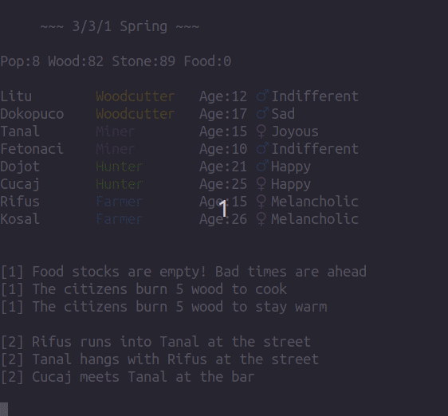
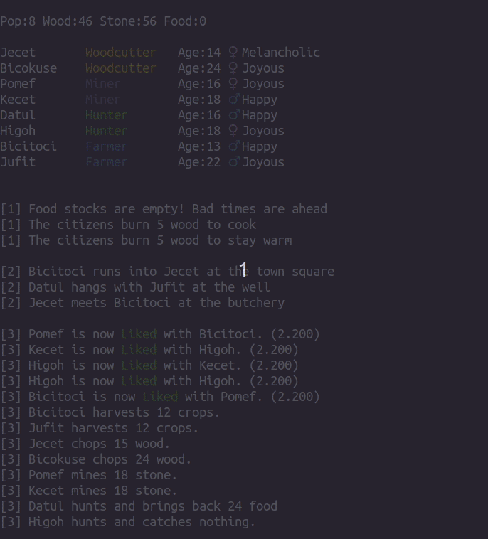

# Village Simulator
A civilization simulator with a focus on person to person
interactions and personality archetypes. Heavily inspired
from the history generation system Dwarf Fortress.


# Running the sim
```bash
python main.py
```




After running press any key to simulate a day. Events will
happen at random, from villagers meeting and talking to 
bar brawls.

# Modifying the world
Playing around with variables in configGlobals.py can
create drastically different outcomes for the village.

# Relationships
Villagers can gain or lose favor with their peers based on
actions taken. For example, if disliked a villager might
opt to attack a rival. Conversely, old friends might be seen
sharing a drink at the local pub.




# Personality Traits
Villagers are created with a five dimensional personality
system based on the OCEAN Model (similar to the myers briggs).
This effects how well villagers work together, their happiness,
and what jobs villagers will perform well.
